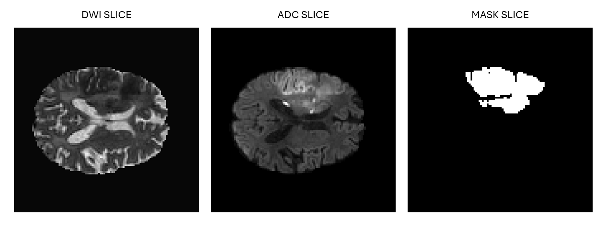
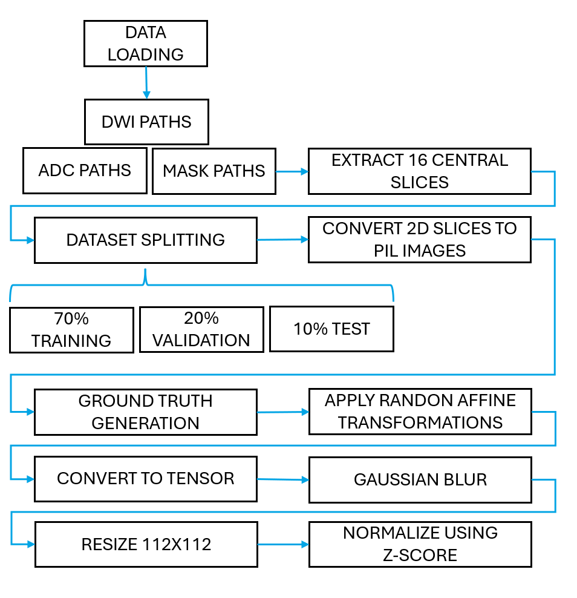
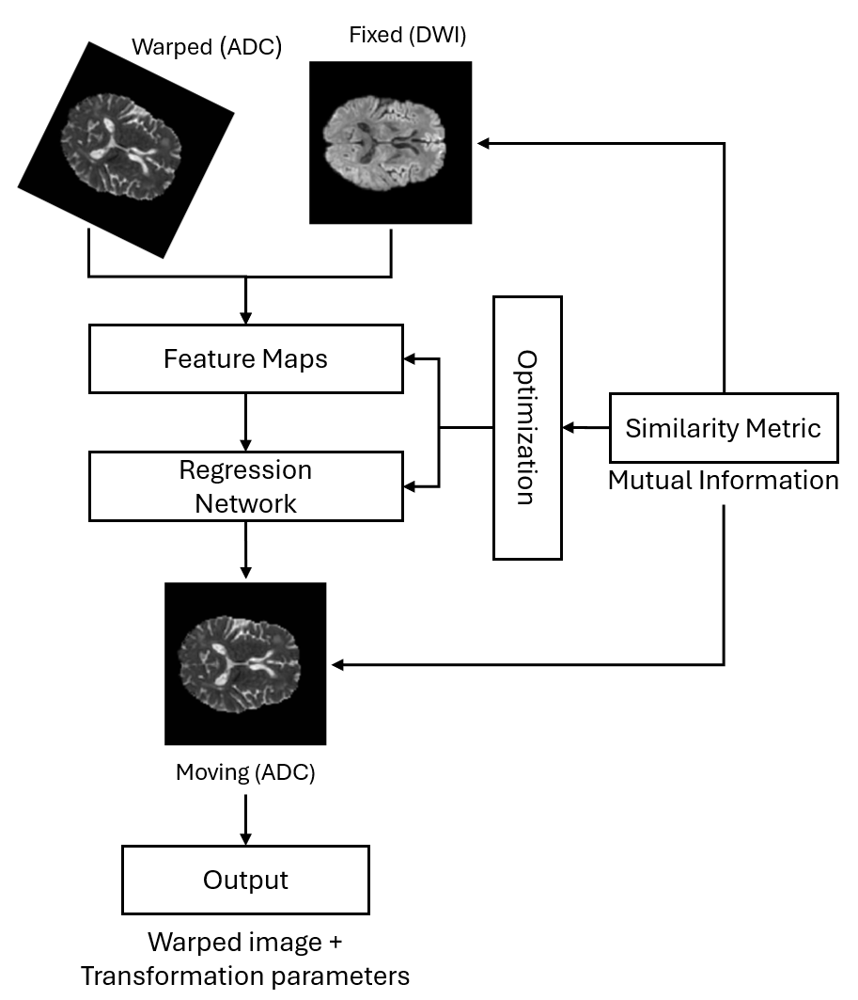

# FAST-UNSUPERVISED-AFFINE-REGISTRATION-OF-DWI-AND-ADC-BRAIN-MRI-FOR-ACUTE-ISCHEMIC-STROKE

This repository contains the official PyTorch implementation of an unsupervised Convolutional Neural Network (CNN) framework designed for the affine registration of multiparametric Magnetic Resonance Imaging (MRI) in acute ischemic stroke.

The model corrects spatial misalignment between Diffusion-Weighted Imaging (DWI) and Apparent Diffusion Coefficient (ADC) maps, optimizing directly for image similarity without requiring ground-truth deformation fields.

## 1. Dataset
The study utilizes the **ISLES 2022 Challenge** dataset, comprising MRI examinations from patients with acute ischemic stroke.
* **Fixed Image:** Diffusion-Weighted Imaging (DWI) serves as the spatial anchor.
* **Moving Image:** Apparent Diffusion Coefficient (ADC) maps.
* **Evaluation:** Binary lesion masks are strictly preserved to compute post-registration geometric overlap metrics.

* **Data Availability:** Due to licensing restrictions, the ISLES 2022 Challenge dataset cannot be directly hosted in this repository. Researchers can access the full dataset by registering on the official [ISLES 2022 Grand Challenge page](https://isles22.grand-challenge.org/). 

---

## 2. Data Preprocessing Pipeline
To simulate clinically plausible patient movement and ensure robust training, the data undergoes a strict preprocessing workflow:
* **Extraction & Splitting:** The 16 central axial slices of each 3D volume are extracted to capture the most relevant anatomical regions. The dataset is partitioned at the patient level (70% Training, 20% Validation, 10% Test) to prevent data leakage.
* **Synthetic Misalignment:** Random affine perturbations (translations, rotations, and scaling) are applied exclusively to the ADC images and their corresponding masks to create the baseline geometric error.
* **Augmentation & Normalization:** Images are resized to 112x112 pixels and subjected to Gaussian blurring. Continuous anatomical intensities (DWI and ADC) are standardized using **Z-score normalization**.
* **Mask Integrity:** Crucially, binary lesion masks bypass the Z-score normalization and are transformed using strictly *nearest-neighbor interpolation*, ensuring that categorical labels (0 and 1) remain intact for accurate metric evaluation.

---

## 3. CNN Architecture
The core of this repository is an unsupervised regression CNN designed to predict spatial transformations:
* **Feature Extraction:** The network ingests a concatenated tensor of the fixed (DWI) and moving (ADC) images, passing through a series of convolutional layers with Batch Normalization and ReLU activations.
* **Regression Head:** A fully connected network flattens the extracted feature maps and outputs **six affine transformation parameters** ($\theta$).
* **Spatial Transformer Network (STN):** The predicted parameters are used to generate an affine grid, which warps the moving image into alignment with the fixed space.
* **Optimization:** The framework is trained end-to-end using a **Global Mutual Information (MI)** loss function, which effectively captures the non-linear intensity relationships between the distinct DWI and ADC contrast mechanisms.

